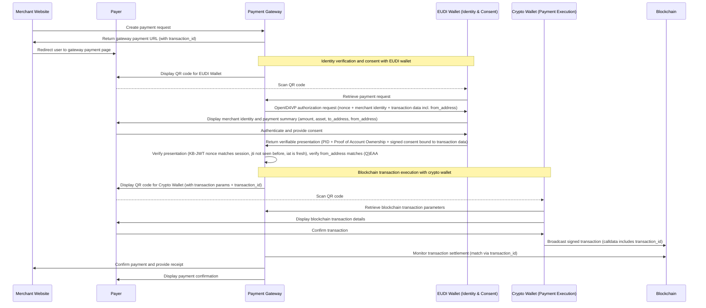
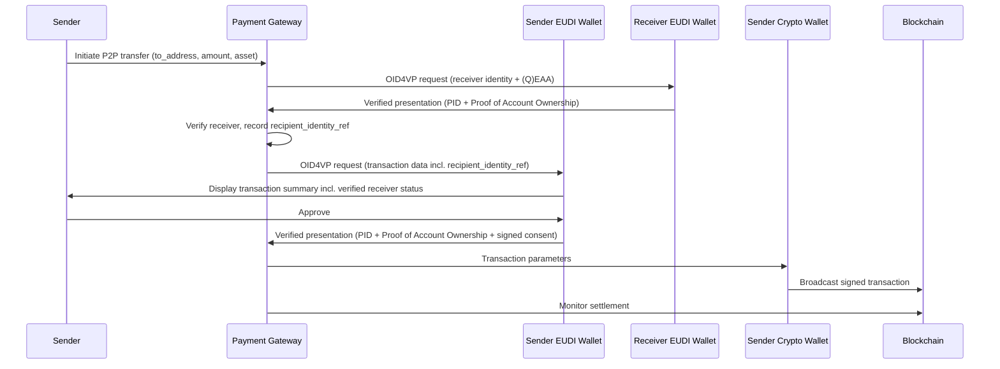
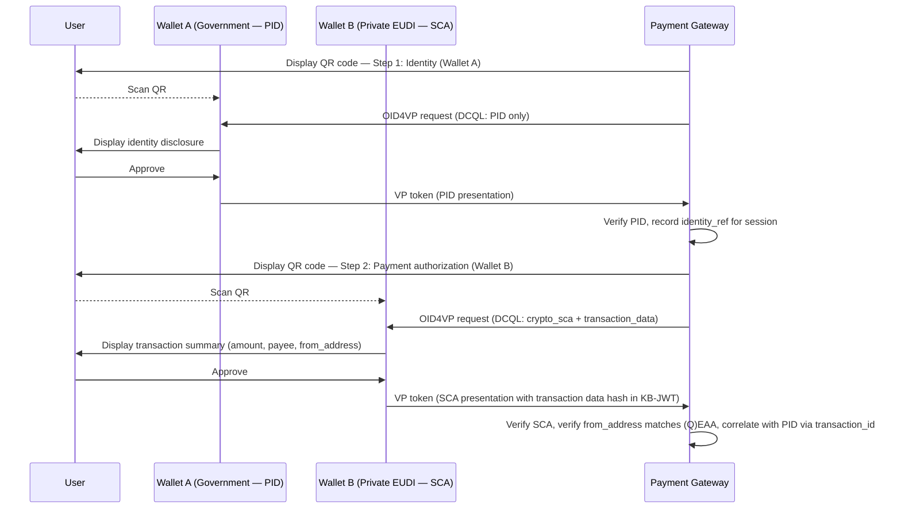

# Secure Crypto Payments from Natural Persons to Merchants Using the EUDI Wallet

Version 0.7.0

13 March 2026

> **Change log from v0.6.5:**
> Added Section 5a (Credential Issuance Flow), Section 14 (Dynamic Linking Requirements), Section 15 (Replay Protection), Section 16 (Receiver Mutual Authentication — P2P Extension), Section 16a (Split-Wallet Model), Section 17 (On-Chain Consent Anchoring), Section 18 (Credential Lifecycle and Revocation), and Section 19 (Open Issues for TS12 Working Group). Added `from_address` and `transaction_id` to the transaction data model. Added amount precision guidance. Added TypeScript type definitions annex. Replay protection relies on TS12-mandated KB-JWT `jti` (PSD2 Authentication Code) and OID4VP `nonce` — no additional payload fields introduced.

---

# 1. Executive Overview

This use case demonstrates how the **European Digital Identity Wallet (EUDI Wallet)** can enable secure and compliant **person-to-merchant (P2M) crypto-asset payments** while preserving the decentralized nature of blockchain settlement.

The model allows a natural person to pay a merchant using a **self-custodial crypto wallet**, while relying on the **EUDI Wallet as the trusted identity and authentication layer**. Through verifiable attestations, the payer proves both their identity and their control of the blockchain address used for the payment.

The architecture establishes a payment flow where:

- A natural person initiates a payment using the **EUDI Wallet**
- Identity authentication is performed using the **EUDI Wallet**
- User consent is captured and **legally binding**
- The **user executes the blockchain transaction directly**, maintaining full control of their assets through their **self-custodial crypto wallet**
- **No custodial intermediary or payment processor** executes the transaction on-chain

This approach combines the strengths of decentralized blockchain infrastructure with the trust framework of the European Digital Identity ecosystem.

The architecture integrates:

- **Decentralized blockchain settlement**
- **Qualified Electronic Attestations of Attributes ((Q)EAA)** for identity and blockchain address control
- **Privacy-preserving selective disclosure**
- **Strong Customer Authentication aligned with EU payment standards (current TS12)**
- **Regulatory alignment with EU frameworks including eIDAS 2.0, MiCA, TFR, and GDPR**

By combining verifiable digital identity with self-custodial crypto asset-payments, this model illustrates how the **EUDI Wallet can act as the trusted identity and consent layer for next-generation digital payments in Europe**.

# 2. Architecture Overview

The proposed architecture separates **identity, payment authorization, and transaction execution** into distinct components while preserving the decentralized nature of blockchain settlement.

The **EUDI Wallet** provides the identity and authentication layer. It allows the payer to present verifiable credentials, prove control of a blockchain account through a Proof of Crypto Account Ownership credential, and provide explicit consent for the transaction using strong authentication mechanisms aligned with ARF TS12.

The **crypto wallet** remains responsible for payment execution. It holds the user's private keys and signs the blockchain transaction, ensuring that funds remain under the full control of the payer through a **self-custodial model**.

A **payment gateway** orchestrates the payment interaction. It generates the structured payment request, provides verified merchant identity attributes, initiates the OpenID4VP authentication request, and monitors the blockchain to confirm settlement.

In this architecture, the blockchain acts purely as the **settlement layer**, while identity verification and consent are handled off-chain through the EUDI trust framework. This separation allows identity-verified crypto payments without introducing custodial intermediaries or compromising user control over assets.

# 3. Roles and Actors

## Payer (Natural Person)

* Holds an **EUDI Wallet** used for identity authentication and explicit transaction consent
* Holds a **self-custodial crypto wallet** used to execute the blockchain transaction
* Holds a **Proof of Identity credential (PID or equivalent)** linking their identity to the wallet device
* Holds a **Proof of Crypto Account Ownership credential (SCA as QEAA)** linking their blockchain address to the wallet device

## Merchant (Legal Person)

* Registered legal entity providing goods or services
* Holds a **receiving self-custodial crypto wallet address**
* May present **verifiable attestations proving legal identity and blockchain address ownership**

## Payment Gateway (Verification and Orchestration Layer)

* Onboards and verifies merchants (KYB process or EU Business Wallet credentials)
* Acts as the **Verifier / Relying Party** in OpenID4VP authentication flows with the EUDI Wallet
* Orchestrates the payment authorization session and manages transaction context
* Prepares the structured **payment request and transaction payload** presented to the payer
* Verifies identity and **Strong Customer Authentication (SCA)** attestations returned by the EUDI Wallet
* Monitors the blockchain to detect and match the corresponding on-chain transaction
* Generates and distributes payment confirmations and transaction receipts
* **Does not hold or control user funds**
* **Does not execute blockchain transactions on behalf of the user**
* **Not a Payment Service Provider (PSP) nor a Crypto-Asset Service Provider (CASP)**

## Blockchain Network

* Public blockchain infrastructure (e.g., Ethereum, Tezos, or compatible DLT)
* Serves as the **settlement layer** for the crypto transaction
* Records transactions immutably and provides publicly verifiable confirmation

# 4. Alignment with ARF TS12 Strong Customer Authentication

This payment flow aligns with the **Strong Customer Authentication (SCA) framework defined in ARF Technical Specification TS12**, which specifies how wallet-based attestations can be used to authorize transactions through verifiable presentations and transaction-bound consent.

In this model, SCA is implemented through a **Proof of Crypto Account Ownership credential**, issued as a **Qualified Electronic Attestation of Attributes (QEAA)** by a **Qualified Trust Service Provider (QTSP)**.

This credential provides verifiable proof that the payer controls a specific blockchain address without exposing private keys, sensitive wallet information or user data.

The payment authorization follows a **third-party requested SCA flow**, where the **Payment Gateway acts as a Verifier (Registered Relying Party)** initiating the OpenID4VP Authorization Request.

The request contains structured transaction data describing the crypto payment and asks the user to present:

* a **Person Identification Data (PID)** credential or equivalent identity attestation
* a **Proof of Crypto Account Ownership credential (as an SCA in TS12)**

The EUDI Wallet processes the authorization request, displays the transaction details to the user, and—upon explicit consent—returns a **verifiable presentation** containing the requested identity attributes and the SCA proof bound to the transaction.

After authentication, the **actual payment execution is performed directly by the user using their own self-custodial crypto wallet**.

The user signs and broadcasts the blockchain transaction themselves. No intermediary executes the on-chain transaction on behalf of the user.

The **Payment Gateway does not custody funds and does not sign or submit blockchain transactions on behalf of the user**.

Instead, it verifies that the payment has been executed successfully by monitoring the blockchain and matching the transaction to the original payment request using the `transaction_id` included in both the payment request and the blockchain transaction metadata.

Importantly, **no personal data or identity attributes are written to the blockchain**.

Identity verification occurs entirely off-chain through the EUDI Wallet, while the blockchain is used solely as the **settlement layer** for the crypto transfer.

# 5. Proof of Crypto Account Ownership Credential

## 5.1 Purpose

The Proof of Crypto Account Ownership is a **Qualified Electronic Attestation of Attributes (QEAA)** issued by a QTSP into the holder's EUDI Wallet. It binds a verified identity to a specific blockchain address and proves that the holder controls the private key associated with that address.

This credential functions as the **SCA Attestation** within the TS12 framework, adapted for decentralized, non-custodial wallet contexts.

## 5.2 Credential Schema (SD-JWT VC)

The credential uses SD-JWT VC format. The `cnf` claim binds the credential to the holder's EUDI Wallet device key. The `caip2_chain_id` field follows the [CAIP-2](https://github.com/ChainAgnostic/CAIPs/blob/main/CAIPs/caip-2.md) standard, enabling multi-chain support beyond EVM networks.

### Ethereum example

```json
{
  "iss": "https://issuer.qtsp.com",
  "iat": 1683000000,
  "nbf": 1683000000,
  "exp": 1883000000,
  "vct": "urn:eudi:sca:crypto:1",
  "cnf": {
    "jwk": {
      "kty": "EC",
      "crv": "P-256",
      "x": "TCAER19Zvu3OHF4j4W4vfSVoHIP1ILilDls7vCeGemc",
      "y": "ZxjiWWbZMQGHVWKVQ4hbSIirsVfuecCE6t4jT9F2HZQ"
    }
  },
  "blockchain_network": "Ethereum",
  "caip2_chain_id": "eip155:1",
  "account_address": "0xc5d4d295878ca7a846614104d5ea3f00fcf408f2",
  "revocation_id": "https://issuer.qtsp.com/status/42#17"
}
```

### Tezos example

```json
{
  "iss": "https://issuer.qtsp.com",
  "iat": 1683000000,
  "nbf": 1683000000,
  "exp": 1883000000,
  "vct": "urn:eudi:sca:crypto:1",
  "cnf": {
    "jwk": {
      "kty": "EC",
      "crv": "P-256",
      "x": "TCAER19Zvu3OHF4j4W4vfSVoHIP1ILilDls7vCeGemc",
      "y": "ZxjiWWbZMQGHVWKVQ4hbSIirsVfuecCE6t4jT9F2HZQ"
    }
  },
  "blockchain_network": "Tezos",
  "caip2_chain_id": "tezos:NetXdQprcVkpaWU",
  "account_address": "tz1VSUr8wwNhLAzempoch5d6hLRiTh8Cjcjb",
  "revocation_id": "https://issuer.qtsp.com/status/42#18"
}
```

**Field definitions:**

| Field | Type | Required | Description |
|---|---|---|---|
| `iss` | string | MANDATORY | Issuer URI (QTSP DID or HTTPS URL) |
| `vct` | string | MANDATORY | MUST be `urn:eudi:sca:crypto:1`. Issuer-independent URN; display metadata is resolved from the `vct` metadata document or the wallet's CAIP-2 chain registry — not stored in the credential. |
| `cnf.jwk` | object | MANDATORY | Holder's EUDI Wallet device public key. Binds the credential to the wallet instance. |
| `blockchain_network` | string | MANDATORY | Human-readable network name (e.g. "Ethereum", "Tezos"). Informational; wallets SHOULD use `caip2_chain_id` as the authoritative chain identifier. |
| `caip2_chain_id` | string | MANDATORY | CAIP-2 chain identifier (e.g. "eip155:1"). The authoritative chain reference used for all validation logic. |
| `account_address` | string | MANDATORY | Blockchain address in network-native format (EIP-55 checksummed for EVM). |
| `revocation_id` | string | MANDATORY | StatusList2021 entry URI for credential revocation checks. |

> **Display metadata:** Chain logos, credential display names, and per-claim labels are intentionally excluded from the credential payload. They belong in the `vct` metadata document (resolvable from the `vct` URN) or in the wallet's built-in CAIP-2 chain registry. Embedding display URLs in a signed credential couples cryptographic assertions to CDN availability and creates unnecessary revocation surface.

# 5a. Credential Issuance Flow

The issuance protocol uses **OID4VCI** (OpenID for Verifiable Credential Issuance). The QTSP Issuer MUST verify both the applicant's identity and their control of the blockchain address before issuing the credential.

## Identity Verification

The applicant presents their **PID credential** via an OID4VP presentation to the Issuer. The Issuer verifies the PID and records a reference to it (a hash of the credential identifier — not the PID data itself) as the binding between the issued (Q)EAA and the verified identity.

## Blockchain Address Control — Challenge-Response

The Issuer verifies that the applicant controls the private key of the declared `account_address` through a cryptographic challenge-response:

1. The Issuer generates a random **nonce** (≥ 32 bytes, hex-encoded) and records its issuance timestamp.
2. The applicant signs the nonce using their crypto wallet private key:
   - **EVM chains (EIP-55 addresses):** `personal_sign("\x19Ethereum Signed Message:\n" + len(nonce) + nonce)`
   - **Tezos:** Micheline-packed signature using the address key
   - **Smart contract addresses (ERC-1271):** `isValidSignature(nonce_hash, signature)` called on the contract
3. The Issuer verifies the signature recovers to (or is accepted by) the declared `account_address`.
4. The Issuer verifies the nonce was freshly issued (max age: 5 minutes) and has **not been used before** (replay protection).

## Binding

Upon successful verification, the Issuer issues the credential with:
- The `cnf.jwk` set to the applicant's **EUDI Wallet device key** (not the crypto wallet key)
- The `account_address` set to the verified blockchain address
- The `caip2_chain_id` set to the verified network

The EUDI Wallet device key is the binding mechanism for presentation purposes. The blockchain address control was verified at issuance time and is asserted by the QTSP's signature on the credential.

> **Note:** The crypto wallet private key is **never transmitted** to the Issuer. Only the signed challenge and the public address are shared.

# 6. Regulatory Positioning

## eIDAS 2.0

* Identity authentication via the **EUDI Wallet**
* Use of **Qualified Electronic Attestations of Attributes (QEAA)**
* Legally recognized authentication across EU Member States

## MiCA (Markets in Crypto-Assets Regulation)

* Supports compliance for crypto-asset acceptance
* Enables off-chain identity-bound transactions
* Facilitates traceability for regulated commerce
* For transfers above the TFR threshold, the `from_address` field in the transaction data (see Section 13) provides the originator address; combined with the payer's PID presentation, this enables originator identification without writing personal data to the blockchain

## TFR (Travel Rule)

* Enables originator identification where required
* Allows selective disclosure
* Supports risk-based compliance
* The `from_address` in the signed transaction data payload provides cryptographic linkage between the payer's authenticated identity and their sending blockchain address

## GDPR

* Data minimisation
* No personal data written on-chain
* Selective disclosure mechanisms
* Privacy-by-design architecture

## PSD2 / PSD3 Alignment

* Payment authorization remains under **direct control of the payer**
* Authentication follows principles comparable to **Strong Customer Authentication (SCA)**
* Transaction approval includes **dynamic linking of transaction parameters** (payee, amount, and sender address — see Section 14)
* No intermediary **payment service provider executes the transaction**

PSD2 primarily regulates **fiat payment services provided by regulated payment service providers** and does not directly govern **peer-to-peer crypto-asset transfers executed from self-custodial wallets**.

However, this architecture aligns with key **PSD2 security principles**, including strong user authentication, explicit user consent, and **dynamic linking of authentication to transaction data through cryptographic signing**.

The design is also compatible with the direction of **PSD3 and the upcoming Payment Services Regulation (PSR)**, which reinforce authentication, fraud prevention, and user protection requirements.

# 7. Business & Ecosystem Impact

## For Merchants

* Reduced fraud and phishing risks
* Strong payer authentication through verified digital identity
* Lower transaction costs compared to traditional payment infrastructures
* Seamless readiness for cross-border EU payments

## For Consumers

* Full control over their digital assets
* Transparent and verifiable merchant identity
* Strong transaction consent protection
* Reduced intermediary costs
* Ability to use cryptocurrency in **legally compliant commercial transactions**

## For the EUDIW Ecosystem

* Introduces innovation through **Web3 identity-bound payments**
* Attracts digitally native and next-generation users
* Prepares the ecosystem for future **Digital Euro integration**

# 8. Trust Model

Trust in the system is established through **two complementary trust relationships**:

1. Trust between the **user wallet and the Relying Party (payment gateway)**
2. Trust between the **merchant and the payer's wallet attestations**

These relationships are supported by **identity verification, cryptographic attestations, and decentralized blockchain settlement**.

## Trust from the User Wallet Perspective

The user's wallet interacts only with the **Relying Party (RP)** that initiates the credential request using the **OpenID4VP protocol**.
The RP in this architecture is the **payment gateway**.

The wallet establishes trust by verifying that the RP is authorized within the **EUDI trust framework**.

This trust is established through:

1. **Relying Party authentication** using a *Wallet Relying Party Access Certificate* issued under the EUDI trust framework.
2. Verification that the RP is **registered and authorized** to request the required credentials.
3. Presentation of the **transaction context** (merchant name, payment amount, blockchain address) to the user before consent.
4. **Explicit user consent and authentication** using an **advanced electronic signature** generated by the wallet.

From the wallet's perspective, the trusted counterparty is therefore the **Relying Party operating the payment gateway**, which is responsible for presenting accurate transaction information.

## Trust from the Merchant Perspective

The merchant obtains trust from the **cryptographically verifiable attestations and signatures generated by the user's wallet**.

This trust is established through:

1. **Payer identity verification** using the **PID (or equivalent identity attestation)** issued within the EUDI ecosystem.
2. **Proof of crypto account ownership**, issued as a **Qualified Electronic Attestation of Attributes (QEAA)** linking the payer to a blockchain address.
3. A **user-generated advanced electronic signature** authorizing the transaction.
4. **Blockchain settlement**, providing publicly verifiable and timestamped confirmation that the payment has been executed.

The merchant therefore relies on **wallet-issued attestations and blockchain confirmation**, rather than performing direct identity verification of the payer.

## Decentralized Settlement

The payment itself is executed through the **blockchain network**, which provides a **decentralized and publicly verifiable settlement layer**.

No centralized payment processor validates or executes the transaction itself.
The payment gateway acts only as a **Relying Party that verifies credentials and facilitates the interaction between the wallet, the merchant, and the blockchain network**.

## Summary of Trust Relationships

```
User Wallet → trusts → Payment Gateway (Relying Party)
Merchant    → trusts → Wallet attestations and signatures
Both parties → trust → Blockchain settlement
```

# 9. Detailed Transaction Flow

> The flow involves **two distinct user wallets**:
> the **EUDI Wallet**, used for identity verification and payment authorization, and the **self-custodial crypto wallet**, which holds the user's private keys and executes the blockchain transaction.

## Step 1 — Merchant Payment Request

The merchant generates a structured payment request through the **payment gateway**, including:

- Merchant identifier (provided by the gateway)
- Legal name
- Blockchain account address
- Amount
- Asset

The gateway assigns a `transaction_id` to the session and delivers the payment request to the payer.

## Step 2 — Merchant Identity Disclosure (EUDI Wallet)

The **payment gateway provides verified merchant identity attributes** associated with the payment request.

The payer reviews these attributes in the **EUDI Wallet** before continuing.

## Step 3 — Payer Authentication (EUDI Wallet)

The flow is initiated through an **OpenID4VP Authorization Request** aligned with **ARF TS12 (Payment with SCA)**.

The user presents:

- a **Person Identification Data (PID)** credential or another identity attestation
- a **Proof of Crypto Account Ownership credential** (SCA as a (Q)EAA)

Selective disclosure is applied and **no private keys are exposed**.

This step proves that the payer **controls the crypto account that will execute the payment**.

## Step 4 — Payment Authorization (EUDI Wallet)

The payer reviews a **structured transaction summary** including:

- merchant identity (from the gateway)
- blockchain address
- amount and asset (displayed in human-readable form, e.g. "100.00 USDC")
- payer's own sending address (`from_address`)

The user provides **explicit consent** using an **advanced electronic signature**. The signed response cryptographically binds all transaction parameters (see Section 14 — Dynamic Linking Requirements).

## Step 5 — Transaction Execution (Crypto Wallet)

After authorization, the payer is redirected to their **self-custodial crypto wallet application**.

The self-custodial crypto wallet:

- retrieves the transaction parameters
- signs the transaction using the payer's **private key**
- broadcasts the transaction to the **blockchain network**

This step is executed **entirely within the user's self-custodial crypto wallet**, which remains **separate from the EUDI Wallet**.

## Step 6 — Receipt & Confirmation

The **payment gateway monitors the blockchain** and confirms settlement once the transaction is included on-chain, matched via the `transaction_id` included in the transaction metadata.

A receipt or confirmation is returned to the merchant and payer.

# 10. Risk & Liability Analysis

## Reduced Risks

This architecture mitigates several risks commonly associated with crypto asset-payments:

* **Merchant address substitution**
  The payer reviews merchant identity attributes provided by the payment gateway before authorizing the transaction.
* **Fake QR codes or malicious payment links**
  Structured payment requests prevent users from blindly sending funds to arbitrary blockchain addresses.
* **Merchant impersonation**
  Merchant identity information disclosed through the gateway allows the payer to verify the entity requesting payment.
* **Payment request tampering**
  Transaction parameters (amount, asset, destination address, and sender address) are bound to the authorization via dynamic linking.
* **Address-replacement malware**
  The payer reviews the structured transaction summary in the EUDI Wallet before the transaction is executed.
* **Presentation replay attacks**
  The OID4VP `nonce` (bound into the KB-JWT) ensures each presentation response is single-use and tied to a specific gateway request, preventing replay of captured presentations (see Section 15).
* **Unattributed high-value transfers**
  Authentication using PID and proof of crypto account ownership introduces **identity accountability** for transactions when required.

## Legal Strength

The flow introduces legally relevant safeguards that are typically absent from standard crypto asset payments:

* **Explicit user consent**
  The payer approves the transaction through a **signed authorization step in the EUDI Wallet**.
* **Identity-bound authorization using eIDAS-qualified attestations**
  Authentication relies on a **PID and qualified electronic attestations of attributes issued under the eIDAS framework**, combined with proof of crypto account ownership. This links the transaction approval to a **verified and legally recognized user identity**.
* **End-to-end cryptographic transaction integrity**
  The blockchain transaction is signed by the payer's **self-custodial crypto wallet**, which is linked to the signed authorization step, ensuring the integrity of the payment execution.
* **Verifiable audit trail**
  The combination of **qualified identity attestations, signed consent, and blockchain settlement** creates a **traceable and auditable payment flow**.

# 11. Digital Euro Readiness

The architecture is compatible with emerging design principles of the **Digital Euro** being developed by the European Central Bank.

Key aspects of the model align with publicly stated Digital Euro requirements:

* **Identity–payment separation**: The EUDI Wallet provides a trusted identity layer while payment execution can remain under supervised financial intermediaries, consistent with the Digital Euro's **intermediated distribution model**.
* **Strong authentication**: Transaction authorization follows mechanisms comparable to **Strong Customer Authentication (SCA)** expected for Digital Euro payments.
* **Pan-European merchant payments**: The flow supports **payer-initiated merchant payments** compatible with EU-wide acceptance requirements.
* **Privacy-preserving identity**: Selective disclosure through the EUDI Wallet allows identity verification without exposing unnecessary personal data, aligning with the Digital Euro's **privacy-by-design objectives**.

# 12. Scenario — Merchant Requested Payment Flow

The following sequence diagram illustrates the interaction between the payer, the EUDI wallet, the payer's crypto wallet, the payment gateway, and the blockchain during a P2M crypto payment.



# 13. Technical Annex — Transaction Data Model

## OpenID4VP Authorization Request

The Payment Gateway includes transaction data in the OpenID4VP Authorization Request using the `transaction_data` parameter defined in TS12. Credential selection uses **DCQL** (Digital Credentials Query Language) as defined in the OpenID4VP specification and adopted by the ARF. The transaction data type URN is `urn:eudi:sca:crypto:1`.

### Authorization Request example

```json
{
  "response_type": "vp_token",
  "client_id": "https://gateway.example.eu",
  "nonce": "n-0S6_WzA2Mj",
  "dcql_query": {
    "credentials": [
      {
        "id": "pid",
        "format": "dc+sd-jwt",
        "meta": {
          "vct_values": ["eu.europa.ec.eudi.pid.1"]
        },
        "claims": [
          { "path": ["family_name"] },
          { "path": ["given_name"] },
          { "path": ["birth_date"] }
        ]
      },
      {
        "id": "crypto_sca",
        "format": "dc+sd-jwt",
        "meta": {
          "vct_values": ["urn:eudi:sca:crypto:1"]
        },
        "claims": [
          { "path": ["caip2_chain_id"] },
          { "path": ["account_address"] }
        ]
      }
    ]
  },
  "transaction_data_hashes_alg": "sha-256",
  "transaction_data": [
    {
      "type": "urn:eudi:sca:crypto:1",
      "credential_ids": ["crypto_sca"],
      "payload": {
        "transaction_id": "pay_7f3a9b2c1d4e",
        "from_address": "0xc5d4d295878ca7a846614104d5ea3f00fcf408f2",
        "payee": {
          "name": "Pizza Shop",
          "id": "HGHG-1",
          "logo": "https://example.com/pizza-shop-logo.png",
          "website": "https://pizza-shop.com/",
          "account_address": "0xc5d4d295878ca7a846614104d5ea3f00fcf408f2"
        },
        "asset": {
          "symbol": "USDC",
          "address": "0xA0b86991c6218b36c1d19D4a2e9Eb0cE3606eB48",
          "decimals": 6
        },
        "amount": "100000000",
        "amount_display": "100.00 USDC",
        "caip2_chain_id": "eip155:1"
      }
    }
  ]
}
```

> **DCQL note:** The `dcql_query.credentials` array requests minimum necessary claims from each credential. The `transaction_data[].credential_ids` array references the DCQL credential `id` (`"crypto_sca"`) to bind the dynamic linking hash specifically to the SCA credential's KB-JWT, not the PID. The PID is required for identity verification but is not the credential over which transaction data is bound.

## Transaction Data Object — Field Definitions

| Field | Type | Required | Description |
|---|---|---|---|
| `type` | string | MANDATORY | MUST be `"urn:eudi:sca:crypto:1"` |
| `transaction_id` | string | MANDATORY | Gateway-issued identifier linking the off-chain payment session to the on-chain transaction. Included in blockchain calldata by the crypto wallet. |
| `from_address` | string | MANDATORY | Payer's sending blockchain address (network-native format). MUST match `account_address` in the payer's (Q)EAA. Required for TFR originator identification and dynamic linking. |
| `payee.name` | string | MANDATORY | Merchant legal name, displayed to user before consent. |
| `payee.id` | string | MANDATORY | Gateway-assigned merchant identifier. |
| `payee.logo` | string | OPTIONAL | Merchant logo URI for wallet display. |
| `payee.website` | string | OPTIONAL | Merchant website URI. |
| `payee.account_address` | string | MANDATORY | Merchant receiving address (network-native format). |
| `asset.symbol` | string | MANDATORY | Token ticker symbol (e.g. "USDC", "ETH"). |
| `asset.address` | string | CONDITIONAL | ERC-20 contract address. Required for token transfers; absent for native asset. |
| `asset.decimals` | integer | MANDATORY | Token decimal places. Required for the crypto wallet to compute the on-chain amount from `amount`. |
| `amount` | string | MANDATORY | Transfer amount as a **decimal string** in the token's smallest unit (e.g. `"100000000"` for 100 USDC with 6 decimals). String type prevents floating-point precision loss for large values. |
| `amount_display` | string | MANDATORY | Human-readable amount shown to the user (e.g. `"100.00 USDC"`). MUST be displayed before consent is captured. |
| `caip2_chain_id` | string | MANDATORY | CAIP-2 chain identifier (e.g. `"eip155:1"`). MUST match `caip2_chain_id` in the payer's (Q)EAA. |

> **Amount precision note:** `amount` is expressed in the token's smallest unit as a decimal string, matching the value that will be submitted on-chain. `amount_display` is the human-readable representation shown to the user. The crypto wallet derives the on-chain amount directly from `amount` (no conversion needed). The separation prevents any ambiguity between display rounding and execution precision.

## VC Type Metadata

```json
{
  "vct": "urn:eudi:sca:crypto:1",
  "name": "Crypto Account Ownership",
  "description": "Credential proving control of a blockchain address, issued as a QEAA under eIDAS 2.0.",

  "claims": [
    {
      "path": ["blockchain_network"],
      "display": [{ "label": "Blockchain", "locale": "en-GB" }]
    },
    {
      "path": ["account_address"],
      "display": [{ "label": "Account", "locale": "en-GB" }]
    }
  ],
  "transaction_data_types": [
    {
      "type": "urn:eudi:sca:crypto:1",
      "claims": [
        { "path": ["payload", "transaction_id"], "display": [{ "locale": "en-GB", "label": "Transaction ID" }] },
        { "path": ["payload", "amount_display"], "display": [{ "locale": "en-GB", "label": "Amount" }] },
        { "path": ["payload", "asset", "symbol"], "display": [{ "locale": "en-GB", "label": "Asset" }] },
        { "path": ["payload", "payee", "name"], "display": [{ "locale": "en-GB", "label": "Payee" }] },
        { "path": ["payload", "from_address"], "display": [{ "locale": "en-GB", "label": "From" }] }
      ],
      "ui_labels": {
        "affirmative_action_label": [{ "locale": "en-GB", "value": "Confirm Payment" }]
      }
    }
  ]
}
```

# 14. Dynamic Linking Requirements

TS12 mandates that authentication be **dynamically linked** to the specific transaction — the signed response must be cryptographically bound to the payment parameters, not just to the user's identity. The following requirements specify how this is achieved for crypto transfers.

**Requirement DL-1 — User display before consent**
The wallet MUST display `amount_display`, `asset.symbol`, `payee.name`, `payee.account_address`, `from_address`, and `caip2_chain_id` to the user before generating the presentation response. The user MUST explicitly approve the displayed values.

**Requirement DL-2 — Transaction data hash in presentation response**
The presentation response MUST include a hash of the full `transaction_data` object, computed using the algorithm specified in `transaction_data_hashes_alg`. For SD-JWT VC over OID4VP, this hash MUST be bound in the Key Binding JWT (KB-JWT). This ensures the signed response is specific to this transaction and cannot be reused for a different one.

**Requirement DL-3 — Address consistency**
The `from_address` in the transaction data MUST match `account_address` in the payer's presented (Q)EAA. The wallet MUST enforce this check before presenting. A mismatch MUST cause the wallet to abort and display an error.

**Requirement DL-4 — Chain consistency**
The `caip2_chain_id` in the transaction data MUST match `caip2_chain_id` in the payer's (Q)EAA. The wallet MUST enforce this check before presenting.

**Requirement DL-5 — Minimum authentication methods**
The `amr` array in the KB-JWT (REQUIRED by TS12 §3.6) MUST contain at least two objects representing different authentication categories (e.g. `possession` and `inherence`, or `possession` and `knowledge`), consistent with PSD2-RTS Article 5 and eIDAS LoA High requirements.

# 15. Replay Protection

Replay protection in this specification relies entirely on mechanisms already defined by TS12 §3.6 and OID4VP — no additional fields are introduced in the transaction data payload.

TS12 §3.6 requires the following claims in the KB-JWT, all of which contribute to replay protection and authentication traceability:

- **`jti`** (REQUIRED by TS12) — a fresh, cryptographically random value unique per presentation. TS12 designates this as the **PSD2 Authentication Code** for electronic payments. The gateway MUST record the `jti` as used upon receiving a valid response and MUST reject any subsequent response with the same `jti`.
- **`nonce`** (REQUIRED by OID4VP) — bound into the KB-JWT; MUST match the `nonce` the gateway included in the Authorization Request. Ensures the response is tied to a specific session.
- **`amr`** (REQUIRED by TS12) — documents the authentication factors applied. MUST contain at least two objects from different categories (see DL-5).
- **`response_mode`** (REQUIRED by TS12) — the `response_mode` value from the Authorization Request.

**Requirement RP-1 — `jti` uniqueness**
The gateway MUST treat the KB-JWT `jti` as a single-use authentication code. It MUST store used `jti` values and reject any presentation response that presents a previously seen `jti`.

**Requirement RP-2 — `nonce` session binding**
The gateway MUST verify that the `nonce` in the KB-JWT matches the `nonce` it issued in the Authorization Request for this session. Responses with a mismatched or missing `nonce` MUST be rejected.

**Requirement RP-3 — `iat` freshness window (RECOMMENDED)**
TS12 §3.6 states that the KB-JWT `iat` MAY be used by a Relying Party to restrict the timeframe in which the SCA result is accepted. Gateways in this use case SHOULD reject responses where the KB-JWT `iat` is older than 5 minutes at the time of reception, to limit the window for MITM interception.

> All requirements above are grounded in TS12 §3.6 and OID4VP. This extension specification introduces no additional payload fields for replay protection.

# 16. Receiver Mutual Authentication — P2P Extension

The P2M flow described above involves a verified merchant on one side and a verified payer on the other. For **peer-to-peer (P2P) transfers** — where both parties are natural persons and no merchant identity is provided by the gateway — the architecture can be extended to require **mutual authentication**: both sender and receiver present a Proof of Crypto Account Ownership (Q)EAA.

This extension is relevant for:

* High-value P2P transfers above the MiCA/TFR €1,000 threshold
* Salary or benefit payments in crypto-assets
* Cross-border EU transfers requiring both originator and beneficiary identification under TFR

## Extended Transaction Data for P2P

When mutual authentication is required, the gateway includes a `receiver_identity_requested` flag in the transaction data payload, set to `true`. The gateway initiates a separate OID4VP Authorization Request to the **receiver's** EUDI Wallet before the sender proceeds to Step 4.

The receiver's presentation provides:

* Their **PID** (or equivalent identity attestation)
* Their **Proof of Crypto Account Ownership (Q)EAA**, with `account_address` matching the declared `to_address`

Upon successful verification, the gateway adds a `recipient_identity_ref` to the transaction data — an opaque reference (hash of the receiver's credential identifier) that can be provided to regulators for TFR purposes without exposing personal data.

The sender's transaction data is then augmented with:

```json
{
  "receiver_identity_verified": true,
  "recipient_identity_ref": "sha256:def456abc..."
}
```

Both sender and receiver identity references are retained off-chain by the gateway for audit and compliance purposes.

## P2P Sequence (abbreviated)




# 16a. Split-Wallet Model — SCA Credential in a Separate Identity Wallet

## Problem Statement

Some EUDI Wallet implementations — in particular government-issued wallets such as France Identité — restrict credential storage to credentials issued by government authorities or explicitly approved issuers. These wallets will not store third-party (Q)EAAs such as the Proof of Crypto Account Ownership credential.

This is a concrete deployment constraint, not an edge case. In Member States where the primary EUDI Wallet is tightly controlled by a national authority, users will not be able to hold the SCA credential in the same wallet as their PID. The question then is: **can the SCA credential be issued into a separate, EUDI-conformant identity wallet, and can the gateway accept presentations from two different wallets within the same payment session?**

## Architecture

The split-wallet model separates the two credential presentations across two distinct wallet instances, both operating within the EUDI trust framework:

* **Wallet A (Government wallet):** Holds the PID. Used solely for identity verification.
* **Wallet B (Private EUDI-conformant wallet):** Holds the Proof of Crypto Account Ownership (Q)EAA. Used for SCA and dynamic linking.

Both wallets are registered Relying Party-facing EUDI Wallet instances with valid Wallet Trust Anchors. The gateway accepts presentations from each via two sequential OID4VP flows within the same payment session, correlated by the shared `transaction_id`.

## Trust Considerations

This model is architecturally valid but introduces a weaker binding between the identity assertion and the SCA assertion compared to the single-wallet model:

* In the **single-wallet model**, both credentials are co-presented in a single OID4VP response, sharing the same KB-JWT and the same device key. The gateway can cryptographically verify they originate from the same wallet instance.
* In the **split-wallet model**, the two presentations carry different device keys (`cnf.jwk`). The gateway correlates them by session context (`transaction_id`) rather than by shared cryptographic binding.

This session-level correlation is sufficient for most practical purposes. The gateway knows both presentations were made within the same authenticated session, in response to its own requests. However it cannot prove cryptographically that the same physical person controlled both devices simultaneously.

For the PoC and the regulatory context of this specification, session correlation is considered acceptable. For higher-assurance scenarios, the single-wallet model SHOULD be preferred where the wallet accepts third-party (Q)EAAs.

> **Note on Article 5f(2):** The eIDAS 2.0 regulation requires that relying parties in the financial sector accept EUDI Wallet units for strong user authentication. It does not mandate that PID and SCA credentials be co-presented from the same wallet instance. The split-wallet model is therefore compliant with the regulatory requirement, subject to the gateway's own risk policy.

## Flow



## Implications for the Specification

When operating in split-wallet mode, the DCQL query in the gateway's SCA request (Step 2) MUST NOT request PID claims — the PID was already obtained in Step 1. The `transaction_data` binding applies only to the SCA credential's KB-JWT (Wallet B). The gateway MUST record both presentations against the same `transaction_id` in its audit log.

The `credential_ids` reference in `transaction_data` therefore always points to `"crypto_sca"` regardless of which wallet model is used. This keeps the transaction data model identical between single-wallet and split-wallet deployments.

# 17. On-Chain Consent Anchoring

The association between the off-chain identity authentication and the on-chain transaction is established through the `transaction_id`. The gateway MUST construct the full blockchain transaction parameters — including the `transaction_id` encoding — and present them to the user's crypto wallet in Step 5. The crypto wallet signs and broadcasts exactly what the gateway constructed. **No changes to existing crypto wallet software are required.**

This is consistent with how dApp-initiated transactions work today (e.g. via WalletConnect or EIP-1193 provider injection): the application constructs the transaction object and the wallet acts as a signing device.

The specific encoding of `transaction_id` depends on the payment gateway implementation model chosen from Annex A:

## Native Asset Transfers (ETH, MATIC, etc.)

The gateway constructs the transaction with the `data` field encoding the `transaction_id`:

```
tx.data = 0x455544495f504159          // UTF-8 "EUDI_PAY" prefix (8 bytes)
        || UTF-8 bytes of transaction_id
```

Example transaction object presented to the crypto wallet:

```json
{
  "to": "0xMerchantAddress",
  "value": "0xDE0B6B3A7640000",
  "data": "0x455544495f504159pay_7f3a9b2c1d4e",
  "gas": "0x5208",
  "chainId": "0x1"
}
```

## ERC-20 — Event-Based Identification

For standard ERC-20 `transfer(address,uint256)` transactions, the `data` field is already occupied by the function selector and ABI-encoded arguments. The gateway identifies the matching on-chain transaction by monitoring `Transfer` events filtered on `(from_address, to_address, amount)` within a time window following the KB-JWT `iat`. No additional calldata encoding is required.

This is the simplest implementation and requires no modification of the transaction data field. It is the recommended approach for standard ERC-20 tokens where timing-based correlation is unambiguous.

## ERC-20 — Gateway Contract using `transferFrom`

The gateway constructs an `approve` transaction pre-authorized to the gateway contract, followed by a `transferFrom` call. The gateway contract MUST emit an event including the `transaction_id`:

```solidity
event EUDIPayment(
    bytes32 indexed transactionId,
    address indexed from,
    address indexed to,
    uint256 amount,
    address token
);
```

The `transaction_id` string is hashed to `bytes32` for the event: `keccak256(bytes(transaction_id))`. This enables deterministic indexing without length constraints.

## ERC-2612 `permit` + `transferFrom`

The gateway constructs a `permit` signature request presented to the crypto wallet (off-chain signing, no transaction required for the approval step). The subsequent `transferFrom` transaction is submitted by the gateway and MUST emit the `EUDIPayment` event above, with `transaction_id` included.

## ERC-3009 `transferWithAuthorization`

The `ERC-3009` `nonce` parameter can carry the `transaction_id` directly. The gateway constructs the authorization struct with `nonce = keccak256(bytes(transaction_id))`, presented to the crypto wallet for off-chain signing. The gateway submits the authorization and the token contract records the nonce on-chain, providing deterministic linkage.

## Optional Consent Hash Anchoring

For higher assurance scenarios, the gateway MAY additionally anchor a **consent hash** — a hash of the presentation response — to provide post-hoc proof that a specific EUDI Wallet authorization was associated with the transaction. The consent hash is computed as:

```
consent_hash = SHA-256(
  SHA-256(presentation_response_bytes)
  || kb_jwt_jti_utf8_bytes      // the KB-JWT jti (PSD2 Authentication Code, REQUIRED by TS12)
  || kb_jwt_iat_utf8_bytes      // the KB-JWT iat claim value as ISO 8601 string
)
```

For gateway contract implementations, this hash MAY be included as an additional field in the `EUDIPayment` event. For native transfers, it MAY be appended to the `data` field after the `EUDI_PAY` prefix and `transaction_id`.

Only this hash — containing no personal data — is anchored on-chain. The full presentation response is retained off-chain by the gateway.

> **GDPR note:** Only identifiers and hashes are written on-chain. No personal data, PID attributes, or credential content is written to the blockchain. The consent hash is computationally unlinkable to the user's identity for any party that does not already possess the presentation response.

# 18. Credential Lifecycle and Revocation

## Expiry

The Proof of Crypto Account Ownership credential SHOULD have an expiry of 6 to 12 months. Wallets MUST NOT present an expired credential as valid SCA. The payment gateway MUST reject presentations containing expired credentials.

## Revocation

The `revocation_id` field in the credential references a **StatusList2021** entry maintained by the Issuer. The gateway MUST check credential status before accepting a presentation. The Issuer MUST revoke the credential promptly upon:

* The holder notifying the Issuer that the blockchain address is no longer under their control (e.g. key compromise)
* Detection of fraudulent use
* The credential's associated PID being revoked or expired

## Re-issuance

When a holder legitimately changes their primary blockchain address (e.g. migrating to a new wallet), they must complete a new issuance flow (Section 5a) to obtain a credential bound to the new address. The old credential MUST be revoked.

# 19. Open Issues for TS12 Working Group

The following items require resolution before this extension can be finalized for inclusion in TS12.

**[OPEN-1] mDoc / DeviceAuthentication profiling**
The current specification covers SD-JWT VC over OID4VP. For mDoc credential holders, ISO 18013-5 DeviceAuthentication must be profiled to bind the transaction data hash in the SessionTranscript, enabling equivalent dynamic linking compliance. This requires coordination with the TS12 mDoc Rulebook authors.

**[OPEN-2] Issuer qualification**
It is not yet determined whether the Issuer of a Proof of Crypto Account Ownership credential must be a QTSP, a regulated CASP, or may be a non-qualified trust service provider. For the purposes of this PoC, a non-qualified EAA is sufficient. For production use, the legal standing of the credential under eIDAS depends on issuer qualification status.

**[OPEN-3] MiCA/TFR threshold handling**
For transfers below the MiCA/TFR €1,000 threshold, receiver mutual authentication (Section 16) may be optional. The transaction data model should define a `required_verification_level` field to allow the gateway to signal whether receiver (Q)EAA verification is mandatory for a given transfer.

**[OPEN-4] Smart contract wallet signing (ERC-1271)**
For `account_address` values controlled by smart contract wallets (e.g. ERC-4337 account abstraction, Gnosis Safe), the `personal_sign` challenge-response specified in Section 5a is insufficient. An ERC-1271 `isValidSignature()` verification path must be specified for the issuance flow.

**[OPEN-5] EUDIPayment event standardisation**
Section 17 defines a `EUDIPayment` Solidity event for gateway contract implementations. This event signature and the `keccak256(bytes(transaction_id))` encoding convention should be standardised across gateway implementations to enable interoperable on-chain indexing and compliance tooling. A formal ERC proposal may be appropriate.

**[OPEN-6] Split-wallet cryptographic binding**
In the split-wallet model (Section 16a), PID and SCA presentations carry different `cnf.jwk` device keys and are correlated only by session context. The WG should determine whether a stronger binding mechanism is required — for example, a cross-wallet attestation where Wallet A signs a statement authorizing Wallet B to act on behalf of the same holder for this session. This would elevate split-wallet deployments to near-equivalent assurance as the single-wallet model.

**[OPEN-7] Gas cost disclosure**
The wallet display requirements (DL-1) should be extended to mandate display of the estimated total transaction cost including gas fees in the user's local fiat currency, where computable. This is relevant for user protection and informed consent.

# 20. Strategic Sovereignty for Europe

Using the **European Digital Identity Wallet (EUDI Wallet)** as the trust anchor for crypto-asset transactions represents a strategic opportunity for **European digital sovereignty**.

Today, many infrastructures supporting regulated crypto-asset transfers—including identity layers, compliance services, and payment orchestration platforms—are developed and operated by non-European providers. This dependence can expose European economic actors to jurisdictional dependencies, regulatory asymmetries, and extraterritorial enforcement risks.

The introduction of **EUDI Wallets for both natural and legal persons under eIDAS 2.0** enables a European identity framework that can support **wallet-to-wallet crypto transactions for both individuals and businesses**. By leveraging the **EUDI Wallet** as the identity and consent layer for crypto transfers, Europe can establish a **sovereign trust framework** that anchors authentication in a European regulatory framework, enables verified identities for both individuals and companies, and provides a foundation for integration with European financial infrastructures, including the **Digital Euro**.

---

# Annex A — Payment Gateway Implementation Options

The mechanism used to link an off-chain payment request with the corresponding on-chain transaction depends on the implementation model selected. Section 17 describes how the `transaction_id` is embedded in each case. The following summarises the available patterns and their trade-offs.

## ERC-20 Token Payments

### Event-based transaction identification

The simplest implementation consists of monitoring ERC-20 `Transfer` events on the blockchain and identifying transactions that match the expected payment parameters, such as the recipient address and transfer amount, and contain the expected `transaction_id` in calldata.

### Gateway contract using `transferFrom`

In this model, the payment gateway is implemented as a smart contract that receives payment requests and performs token transfers using the ERC-20 `transferFrom` function. The payer first authorizes the gateway contract through an allowance (`approve`), after which the gateway executes the transfer to the merchant blockchain address or settlement vault.

The contract emits an event containing the payment identifier and transaction details, allowing off-chain systems to reconcile the payment with the originating payment request.

### Gateway contract using ERC-2612 `permit`

Where supported by the token, implementers may use the ERC-2612 `permit` extension to streamline the payment flow. The payer signs an off-chain approval message authorizing the gateway contract to transfer a specified amount of tokens. The signed authorization is submitted alongside the payment transaction, allowing the contract to both register the approval and execute the token transfer within a single on-chain transaction.

## Tokens Supporting Extended Authorization Mechanisms

### ERC-3009 transfer authorization

Certain tokens implement authorization-based transfers (ERC-3009), which allow token transfers to be executed directly from a signed authorization message. The payer signs a transfer authorization specifying the recipient, amount, and validity parameters. The gateway or another participant submits this authorization to the token contract, which executes the transfer and records the payment.

## Implementation Flexibility

Implementers may select any of the above approaches, or an equivalent mechanism, provided that the implementation ensures reliable association between the off-chain payment request (`transaction_id`) and the resulting on-chain transaction or settlement event. Implementations SHOULD ensure that the chosen mechanism provides sufficient traceability to support reconciliation, auditability, and operational monitoring of payments.

---

# Annex B — TypeScript Type Definitions (Informative)

```typescript
// Proof of Crypto Account Ownership SD-JWT VC claims
interface ProofOfCryptoAccountOwnership {
  iss:              string;   // Issuer URI
  vct:              "urn:eudi:sca:crypto:1";
  iat:              number;   // Unix timestamp
  exp:              number;   // Unix timestamp
  cnf: {
    jwk:            JsonWebKey; // Holder's EUDI Wallet device key
  };
  blockchain_network: string; // e.g. "Ethereum"
  caip2_chain_id:   string;   // e.g. "eip155:1"
  account_address:  string;   // Network-native address format

  revocation_id:    string;   // StatusList2021 entry URI
}

// TS12 transaction data extension — urn:eudi:sca:crypto:1
interface CryptoPaymentTransactionData {
  type:             'urn:eudi:sca:crypto:1';
  credential_ids:   string[];

  payload: {
    transaction_id:   string;  // Gateway-issued session identifier
    from_address:     string;  // Payer sending address (must match (Q)EAA)
    payee: {
      name:           string;
      id:             string;
      logo?:          string;
      website?:       string;
      account_address:string;
    };
    asset: {
      symbol:         string;
      address?:       string;  // ERC-20 contract address; absent for native
      decimals:       number;
    };
    amount:           string;  // Smallest unit, decimal string
    amount_display:   string;  // e.g. "100.00 USDC"
    caip2_chain_id:   string;  // Must match (Q)EAA

    // P2P extension (optional)
    receiver_identity_verified?: boolean;
    recipient_identity_ref?:     string;
  };
}

// On-chain calldata encoding (for native asset transfers; see Section 17)
const EUDI_PAY_PREFIX = Buffer.from('455544495f504159', 'hex'); // "EUDI_PAY"

function encodeCalldata(transactionId: string): string {
  return '0x' + Buffer.concat([
    EUDI_PAY_PREFIX,
    Buffer.from(transactionId, 'utf8'),
  ]).toString('hex');
}

// Optional consent hash for high-assurance anchoring
// kbJwtJti: the KB-JWT jti (PSD2 Authentication Code, REQUIRED by TS12 §3.6)
// kbJwtIat: the KB-JWT iat value as ISO 8601 string
function computeConsentHash(
  presentationResponseBytes: Uint8Array,
  kbJwtJti: string,
  kbJwtIat: string
): Buffer {
  const inner = crypto.createHash('sha256').update(presentationResponseBytes).digest();
  return crypto.createHash('sha256')
    .update(Buffer.concat([
      inner,
      Buffer.from(kbJwtJti, 'utf8'),
      Buffer.from(kbJwtIat, 'utf8'),
    ]))
    .digest();
}
```

---

*This document is a draft proposal for contribution to the EUDI Wallet Technical Specifications process. It extends the work initiated in v0.6.5 with dynamic linking requirements, replay protection, issuance flow specification, P2P mutual authentication, and on-chain anchoring aligned with TS12.*
